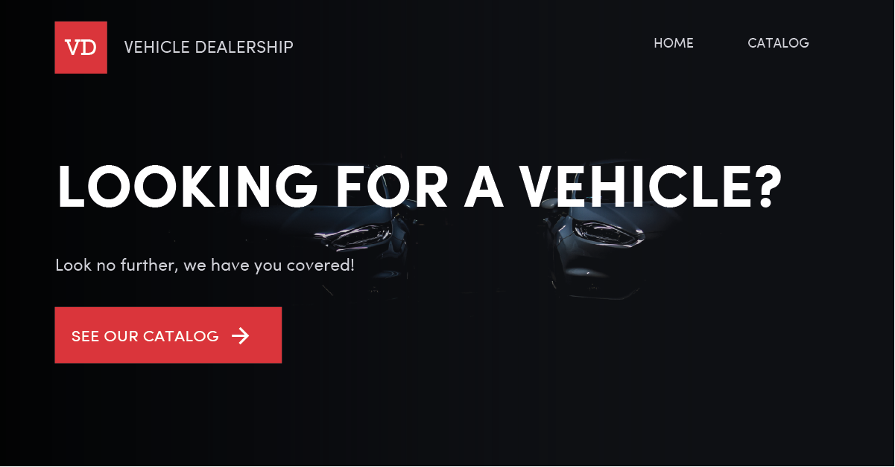

[](https://app.netlify.com/sites/vehicle-dealership/deploys)

# Vehicle Dealership

One Paragraph of project description goes here



## Getting Started

These instructions will get you a copy of the project up and running on your local machine for development and testing purposes. See deployment for notes on how to deploy the project on a live system.

### Prerequisites

What things you need to install the software and how to install them

```
Give examples
```

### Installing

A step by step series of examples that tell you how to get a development env running

Say what the step will be

```
Give the example
```

And repeat

```
until finished
```

End with an example of getting some data out of the system or using it for a little demo

## Deployment

Add additional notes about how to deploy this on a live system

## Built With

- [create-react-app](https://github.com/facebook/create-react-app) - The Toolchain used
- [Hooks API](https://reactjs.org/docs/hooks-intro.html) - State Management

## Authors

- **Eduardo Rodriguez** - _Design & Creation_ - [edroamz](https://github.com/edroamz)

## Acknowledgments

- Hat tip to anyone whose code was used
- Inspiration
- etc
